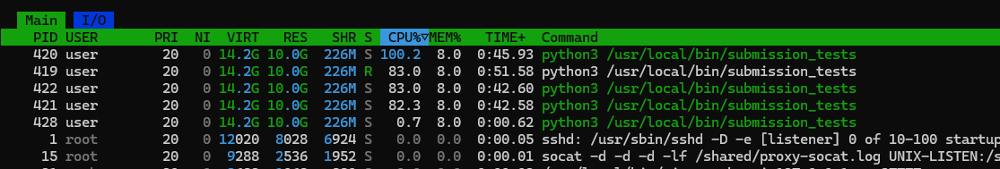
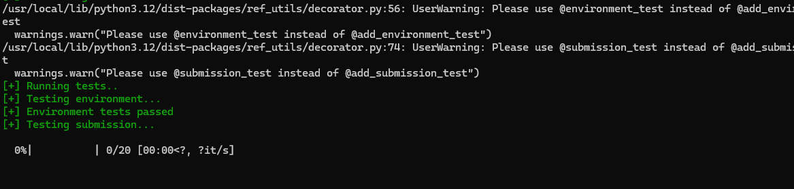
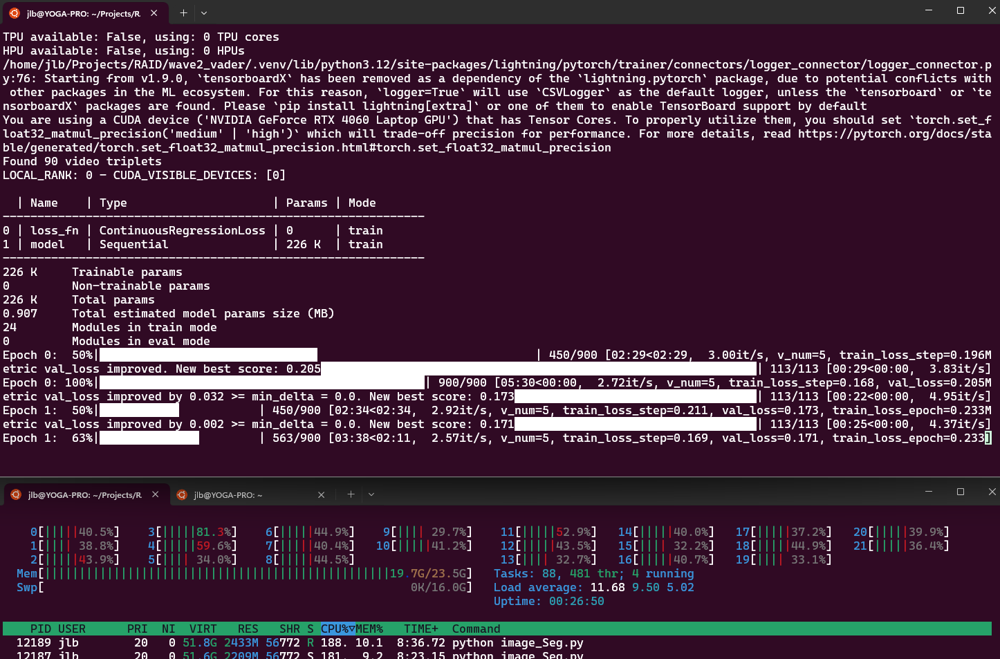

# VADER

# Problem Statement
The task is to reconstruct the leaking background in video frames where a virtual background is applied, but the real background occasionally leaks through. The goal is to create a model that can accurately segment and reconstruct the leaking background from the video frames.

# Solution A

My initial idea was to find some sort of color distribution in the video frames, which would allow me to identify the leaking background using only statistical methods and some clustering. you can find the initial exploration of this approach in [01_data_exploration](01_data_exploration.ipynb). The thought was, that if we take the time series of each pixel, that we might discover different color clusters, which would allow us to identify the leaking background.
However, this approach did not yield the desired results, as the moving person in the video frames caused the color distributions to be too noisy and the clusters not distinct enough to be useful for segmentation.
I still think that this approach has potential, but I wanted results and therefore I decided to switch to a framewise color segmentation task using a convolutional neural network which has already proven to work on a similar task in the past (Modul: Architecture of Machine Learning Systems, Task: Segment Houses from Satellite Images).
The inital experiments are located in the files `reconstruct_bg*.py`, but I never submitted any of them, as they did not convince me.

# Solution B

The image segmentation approach starts with [03_image_segmentation.ipynb](03_image_segmentation.ipynb), where I explore the data and the task. 
The initial problem was to generate labels that can be used to train the model. I decided for a continuous similarity mask, as I don't have exact labels and can only approximate the leaking background with the given ground truth and the video frames, because the when the true background leaks through it is often slightly blurred and also the leaking background is often very similar to the person in the video frames, which made a binary mask with a threshold not feasible. I later got the idea to use the mask to create a threshold by identifying the pixels in the video with the highest similarity, but I didn't have the time to implement this idea in the end. 
> However, I would really like to explore this, and if you could give me the ground truth mask for each frame per video, which you mostlikely have since you created the mask, I would really like to test this on my model and see if it improves the results, since I only used an approximation of the mask and made the model work with that already.


In the [Source Folder](src) you can find the code for the models and training. I implemented two different models, one based on a simple convolutional neural network and one based on a U-Net architecture. The U-Net architecture is more complex and has more parameters, but I wanted to see if it can improve the results. The training is done using PyTorch Lightning, which allows for easy scaling and distributed training. 
The source folder has the following structure:
```text
src
├── data_loader.py
├── helpers.py
├── init.py
├── leak_model.py
├── losses.py
├── masks.py
├── util.py
└── video_dataset.py
```
- The model is implemented in [`src/leak_model.py`](src/leak_model.py) 
- The dataset is implemented in [`src/video_dataset.py`](src/video_dataset.py)
- The masks are implemented in [`src/masks.py`](src/masks.py)
- The loss function is implemented in [`src/losses.py`](src/losses.py)

I have used PyTorch lightning before and found it to be really helpful for training models, as it takes care of a lot of boilerplate code and uses CUDA automatically if available etc.

I also implemented a custom loss function, which should allow for a more fine-grained training of the model. It is a combination of different losses. The loss function is implemented in [`src/losses.py`](src/losses.py) and is used in the training process.


My best model achieved a score of 0.068 on the test server and can be found under:
`lightning_logs/version_24/checkpoints/best-epoch=1-val_loss=0.163.ckpt`

The model is trained and can be loaded and used for inference if you want to try it out.

```python
from src.leak_model import BackgroundLeakSegmenter

class FrameDataset(Dataset):
    def __init__(self, frames_array):
        frames_rgb = frames_array[:, :, :, ::-1]  # BGR to RGB
        self.frames = (
            torch.from_numpy(frames_rgb.copy()).float().permute(0, 3, 1, 2) / 255.0
        )

    def __len__(self):
        return 1

    def __getitem__(self, idx):
        return {"frames": self.frames}

# Load model including filter flags
model = BackgroundLeakSegmenter.load_from_checkpoint(
    "lightning_logs/version_24/checkpoints/best-epoch=1-val_loss=0.163.ckpt",
    use_edge=True,
    use_dog=True,
    # use_mode=True,
    # mode_dir="data_dummy/public/modes",
)
dataset = FrameDataset(frames_array)
dataloader = torch.utils.data.DataLoader(
    dataset,
    batch_size=1,
    # num_workers=0,  # Set to 1 to avoid shared memory issues
    pin_memory=False,  # Also disable pin_memory to save memory
)
trainer = L.Trainer(
    accelerator="auto",
    # devices=1,
    logger=False,
)
predictions = trainer.predict(model, dataloader) 
reconstructed_tensor = predictions[0][0]

################################################
# or just:
reconstruction = model.reconstruct_from_numpy_frames(frames_array)
```


One reconstruction example:


The Folder [reconstruction_results](reconstruction_results) contains the results of 3 different experiments, where I trained the model on different configurations (I implemented other channels, such as a dog filter channel, mode pixel over the whole video, etc.)
You will be able to find good results, but also many, where nearly no background is reconstructed.

The Segmentation models were trained in the following files:
```text
├── exp01_TEST.py
├── exp01_test_new_module.py
├── exp02TEST.py
├── exp02_new_filters.py
├── exp03_TEST.py
├── exp03_create_modes.py
├── exp03_mode_image.py
├── exp04_unet.py
```


The [truesight](truesight) folder contains the inital refactoring of my code for another approach, but is not relevant to the final solution/highest score. 


The other notebooks are basically all about exploring different filters or trying to improve the similarity mask somehow.


# NOTES
# Current experiments
#### vnum=8
- ConvNetSimple
- 15 Epochs
- For some reason the loss turned negative... I don't know why, we will see tomorrow.
- Thresholding is complete dogshit. (v2 Images)
- Just go back to continuous loss. but add the other filters to it maybe!
- We could also try the canny edge filter https://scikit-image.org/docs/0.25.x/auto_examples/edges/plot_canny.html#sphx-glr-auto-examples-edges-plot-canny-py


#### vnum=12
- edge and dog filter.


- Edge and dog filter yielded a result of 0.0653 yaaay, but we can do better  --> also only trained for one epoch. Might be to little!

#### vnum=21 
- Next one: Have the MODE image as another channel
- I think this is shit. Idea was to give an idea about the temporal blah, but seems bulky slow and not converging.
- LEARNING: Don't create extra folders with features in the data folder. They don't like it on the server.
       Test metric             DataLoader 0
─────────────────────────────────────────────
    test_delta_e_mean        19.61074447631836
test_reconstruction_score   0.08497066795825958
ON PAPER Not so bad, let's see in the real world.

--> on TEST SET 0.042 I wanna cry 


#### vnum=24
- same process as vnum=12 but with Unet!
- BEST MODEL 0.068



Submission needs resources. Sometimes it just stops (crashes? Cause no resources are in use anymore, but it doesn't terminate the submission...)



#### WHAT NEXT
- we can improve the MASK actually - instead of just continuous sim mask, we can match this one with the given mask (Ground truth for eval)  and eliminate false positives from the constructed frame mask due to high similarity of pixel to ground truth background (e.g. the shirt of the kid)
- Another idea -> postprocessing - smooth the image, it is very fragmented, maybe this can increase the score
- Also the reconstruction seems to always have a shade on it. Maybe we can remove it.

## 

# TODOS:
-[]  TRY MORE INPUT CHANNELS --> Edge mask etc!
- v_12 is the new test with the edge and dog filter.


# WHY IS THERE NO GPU FOR A VIDEO TASK :(
```bash
tmux new -s submission1
Ctrl-b  then  d 
tmux ls
tmux attach -t submission1
```

# Ideas
- see each pixel as a time series
- then do anomaly detection over it

- other approach - each pixel in the 3D RGB space -> cluster algorithm
- if we have the pixels in the 3D space, maybe we can then select the right pixels

# Obeservations
- the ground truth pixels are often muted


# Approach Color Distributions

- Virtual Background Peak: If the virtual background is applied for a significant portion of the time, the color(s) it uses at a specific pixel will form a prominent peak (or a cluster of closely related peaks) in that pixel's color distribution. This would likely be the highest peak (the mode we were calculating).

- Person Peak(s): When the person in the video occludes that pixel, the colors of their skin, hair, or clothing will also contribute to the distribution. If they are in that spot with some consistency, these colors could form another distinct peak (or several peaks if their attire is multi-colored). This peak might be less frequent than the virtual background but could still be significant.

- Real Background Leak Peak: Your hypothesis is that when the real background "leaks" or "flickers" through, these (often brief) appearances of the real background color will form another, likely smaller, peak in the distribution.


# First Task: Clustering


# Segmentation Task

## Training


- We have the mask, what we could try in the next run is to set a threshold for the mask, make everything 0 below the threshold and the stuff above as is.


## Possible Filters
• Sobel/Scharr/Prewitt gradients

– Compute horizontal and vertical image gradients separately and combine. Good for highlighting edges with simple kernels.

• Laplacian of Gaussian (LoG)

– Smooth with a Gaussian and then apply the Laplacian operator. Detects blobs and fine edges.

• Difference of Gaussians (DoG)

– Approximate LoG by subtracting two Gaussian‐blurred versions (different σ). Useful for multi‐scale blob detection.

• Gabor filters

– Bank of oriented, frequency‐tuned filters. Capture texture and oriented edge information—great for textured backgrounds or repeating patterns.

• Local Binary Patterns (LBP)

– Texture descriptor that encodes the relationship of each pixel to its neighbors; can be used as per‐pixel feature maps.

• Bilateral or Guided filtering

– Edge-preserving smoothers that remove noise while keeping strong edges intact, improving region homogeneity.

• Morphological top-hat / bottom-hat transforms

– Highlight small bright or dark structures on a smooth background—can help isolate thin leak artifacts.

• Non-local means denoising

– Remove noise by averaging over similar patches, preserving structure better than a Gaussian blur.

• Histogram of Oriented Gradients (HOG)

– Compute local gradient histograms—useful features for region proposals or conditioning a network.

• Mean-shift or bilateral mean shift

– Segmentation-oriented smoothing that clusters pixels by intensity and position, giving a rough over-segmentation.


## Code implementation:
### `VideoFrameDataset`

#### `Initialization (init)`

You pass in a list of triplets (video_path, mask_path, bg_path), target frame_size, number of frames to sample per video, and a similarity‐masking method.
It stores those, then calls _build_frame_index() to precompute which frame indices to pull from each video.
Building the frame index (_build_frame_index)

For each triplet it opens the video (via OpenCV’s VideoCapture) just long enough to read its total frame count.
If the video has more frames than your frames_per_video budget, it picks them evenly spaced; otherwise it takes them all.
It then appends (triplet_idx, frame_idx) pairs to self.frame_indices.
Length (len)

Simply returns how many (triplet, frame) pairs you precomputed.
#### `Fetching an item (getitem)`

Given an index i, it looks up (triplet_idx, frame_idx) = self.frame_indices[i].
Loads that single frame via _load_single_frame(), loads/caches the matching background via _load_background(), then computes a continuous similarity mask with your chosen method.
Returns a dict of three tensors:
• 'frame': the RGB frame normalized to [0,1] and permuted to (C,H,W).
• 'similarity_mask': your soft mask as a single‐channel (1,H,W) tensor.
• 'background': the background image tensor, also (3,H,W).
Loading a single frame (_load_single_frame)

Opens the video file anew, seeks to frame_idx, reads one frame, resizes to your frame_size, converts BGR→RGB, then returns the NumPy array.
#### `Loading & caching backgrounds (_load_background)`

Keeps an in-memory dict (self._bg_cache) so each background image is read from disk only once.
On first access, reads with cv2.imread(), resizes, BGR→RGB, stores in the cache, then returns it.
By sampling frames on-demand and caching only backgrounds, this class lets you iterate through potentially thousands of video frames without loading every frame into memory at once.


No – frame_size is just (H, W), so non-square/rectangular sizes like (720, 1280) or (729, 1280) will work fine.

One thing to watch out for: our U-Net encoder applies two 2×2 downsamples (and two 2×2 transposed up-samples), so both H and W should be divisible by 4 (or more generally by 2ⁿ where n is your pool depth) to avoid shape mismatches. If you pick a size that isn’t a multiple of 4, you’ll either need to:

• Pad/crop your inputs to a multiple of 4 before feeding into the model
• Add explicit padding in your conv or transpose-conv layers
• Switch to an upsample (e.g. F.interpolate) that can handle odd sizes gracefully

But there’s no requirement that your crop be square.


### `BackgroundLeakDataModule`
#### `init(…):`

You pass in three dirs (backgrounds_dir, videos_dir, masks_dir), plus hyper-params:
• batch_size, num_workers, frames_per_video, val_split.
These get stored as members for later use by Lightning.
#### `prepare_data():`

Called once on 0th GPU/CPU before anything else.
It simply calls your load_triplets(...) helper to verify you have the expected files on disk.
#### `setup(stage):`

Called on each GPU/CPU after prepare_data.
Reloads the full list of triplets.
Shuffles and splits into train vs. val/test according to val_split.
For “fit” stage you build:
• self.train_dataset with frames_per_video frames sampled per video.
• self.val_dataset with half as many frames for faster validation.
For “test” stage you build self.test_dataset with a quarter as many frames.
#### `train_dataloader()`, `val_dataloader()`, `test_dataloader()`:

Each wraps the corresponding Dataset in a PyTorch DataLoader.
Key settings:
• batch_size (smaller for testing if you like)
• shuffle=True only for train
• num_workers tuned for parallel frame‐loading
• pin_memory=True (faster host→device copy)
• persistent_workers=True for train to keep workers alive across epochs.
Under the hood each dataset is your VideoFrameDataset, which samples individual frames on-demand, builds the continuous similarity masks, and yields dicts of tensors. The DataModule simply orchestrates how and when to instantiate train/val/test splits and wrap them in loaders.


### `ContinuousRegressionLoss`
#### `Initialization (init)`

loss_type: one of {“mse”, “mae”, “smooth_l1”, “focal_mse”, “jaccard_soft”, “combined”}.
α (alpha), β (beta), γ (gamma): weights for primary, gradient, and SSIM components when loss_type=“combined.”
#### `Forward pass (forward)`

Dispatches on self.loss_type:
• mse → torch.nn.functional.mse_loss(pred, target)
• mae → F.l1_loss(pred, target)
• smooth_l1 → F.smooth_l1_loss(pred, target)
• focal_mse → MSE weighted by (error)^(α/2) to focus on large errors
• jaccard_soft → 1 – mean( soft-Jaccard( pred, target ) )
• combined → calls self._combined_loss()
#### `Combined loss (_combined_loss)`
total = α·MSE + β·gradient_loss + γ·ssim_loss

#### `Gradient-based boundary loss (_gradient_loss)`

Convolves both pred and target with 3×3 Sobel-X and Sobel-Y kernels
Computes MSE between pred-gradients and target-gradients
#### `Structural‐similarity loss (_ssim_loss)`

Builds an 11×11 Gaussian window
Computes local μ, σ², and covariance via conv2d
Applies SSIM formula:
ssim = ((2μ₁μ₂ + C₁)(2σ₁₂ + C₂)) / ((μ₁²+μ₂²+C₁)(σ₁²+σ₂²+C₂))
Returns 1 – mean(ssim)


### `create_continuous_similarity_mask`
#### `Signature`
• Inputs:
– frame: H×W×3 uint8 BGR image
– ground_truth_bg: same shape as frame
– method: one of “perceptual_distance”, “cosine_similarity”, “combined”
• Output: H×W float32 array in [0,1]

#### `Color‐space conversions`
• LAB: more perceptually uniform – used for both perceptual and combined methods
• HSV: used in combined to emphasize hue/saturation differences

#### `Branches`
##### `a) “perceptual_distance”`
– Compute Euclidean distance in LAB:
diff_lab[x,y] = || frame_lab[x,y] – bg_lab[x,y] ||₂
– Map to similarity via exp(–diff_lab/50) → values ∈ (0,1]

##### `b) “cosine_similarity” (slow!)`
– Flatten each pixel’s 3-vector in RGB, compute per-pixel cosine similarity
– Clip negatives to zero
– Reshape back to H×W

##### `c) “combined”`
– sim_lab: exp(–||LAB difference||/40)
– sim_hsv: exp(–||HSV[:,:2] difference||/30)
– ssim-like term:
• Convert to grayscale and compute local mean/variance/covariance via a 7×7 uniform kernel
• Apply the SSIM formula per pixel → clipped to [0,1]
– Weighted sum: 0.4·sim_lab + 0.3·sim_hsv + 0.3·ssim

#### `Noise reduction`
• After any branch, apply a 5×5 Gaussian blur (σ=1) to smooth the similarity map

#### `Final clipping`
• Ensure all values lie in [0,1]


### `BackgroundLeakSegmenter`
#### `Initialization (init)`

Saves hyper-parameters: learning_rate, loss_type, model_architecture
Instantiates
• self.loss_fn = ContinuousRegressionLoss(…)
• self.model = _unet() (via _build_model)
Prepares lists to track MAE during train/val
#### `Model construction`

_build_model(architecture) picks between architectures (currently only “unet”)
_build_unet() builds a lightweight U-Net:
• Encoder: two 3×3 conv→ReLU blocks + 2×2 max-pool, repeated twice (32→64 channels)
• Bottleneck: 128-channel 3×3 conv→ReLU
• Decoder: two 2×2 transpose-conv upsampling steps interleaved with conv→ReLU (128→64→32 channels)
• Output: 1×1 conv to 1 channel + Sigmoid
#### `Forward pass`

forward(x) simply calls self.model(x) returning a [B,1,H,W] prediction in [0,1]
#### `training_step(batch, batch_idx)`

Unpacks frames and similarity_masks
Computes predictions = forward(frames)
Computes loss = self.loss_fn(predictions, similarity_masks)
Computes pixel‐wise MAE for logging
Appends to self.train_mae and calls
```python
self.log('train_loss', loss, on_step=True, on_epoch=True, prog_bar=True)  
self.log('train_mae',  mae,  on_step=True, on_epoch=True)  
```
#### `validation_step(batch, batch_idx)`

Same as training_step but logs under “val_…” and appends to self.val_mae
#### `test_step(batch, batch_idx)`

Runs forward on each test batch
For each sample in the batch:
• Converts prediction to a binary mask (pred>0.5)
• Calls your metric_CIEDE2000 + evaluate helpers to get a reconstruction score
• Logs test_reconstruction_score
#### `configure_optimizers()`

Creates Adam optimizer with self.learning_rate
Sets up ReduceLROnPlateau scheduler monitoring “val_loss”
Returns the dict expected by Lightning
This LightningModule thus encapsulates everything from model definition to loss, metrics tracking, and optimizer/scheduler setup, ready to be handed off to a pl.Trainer.


# Settings

```bash
task submit
task reset
task check
task id
task info
```

### Download
```bash
scp -P 2222 <task_name>@raid:/home/user/<filename> <filename>
```

```bash
scp -r -P 2222 vader@raid:/home/user/data .
```


# Upload
```bash
scp -P 2222 <filename> <task_name>@raid:/home/user/<filename>
```

